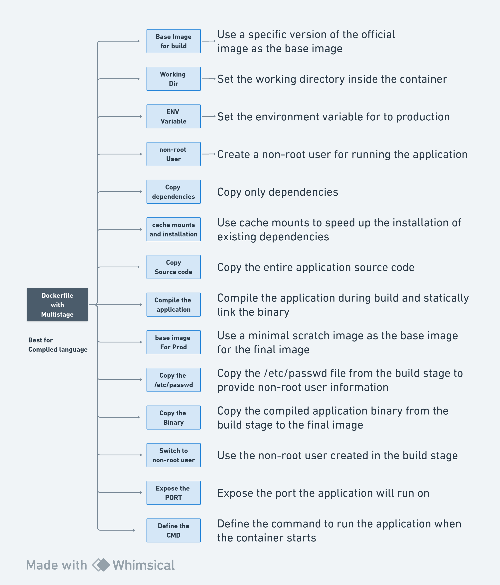

# Building-Dockerfiles

### [View all Roadmaps](https://github.com/nholuongut/all-roadmaps) &nbsp;&middot;&nbsp; [Best Practices](https://github.com/nholuongut/all-roadmaps/blob/main/public/best-practices/) &nbsp;&middot;&nbsp; [Questions](https://www.linkedin.com/in/nholuong/)
 

This repository contains several example projects demonstrating the use of Docker for different applications.

## Prerequisites

Before you begin, ensure you have the following prerequisites:

- [Docker](https://www.docker.com/get-started) installed on your machine.
## Learning How to build a Dockerfile

## Projects

1. ### [Flask-app](./Flask-app)
    - Dockerfile for a Flask application
    - `requirements.txt` file
    - `src` directory containing Flask application code
    - [Readme](./Flask-app/README.md)

2. ### [docker-node-app](./docker-node-app)
    - Dockerfile for a Node.js application
    - `index.js`, `package.json`, `package-lock.json` files
    - [Readme](./docker-node-app/README.md)

3. ### [docker-react](./docker-react)
    - Dockerfile for a React application
    - `package.json`, `package-lock.json` files
    - `public` directory containing static files
    - `src` directory containing React source code
    - [Readme](./docker-react/README.md)

4. ### [simple-http-server-GO](./simple-http-server-GO)
    - Dockerfile for a simple Go HTTP server
    - `go.mod` file for Go modules
    - `go-server.exe` binary executable
    - `static` directory containing static HTML files
    - [Readme](./simple-http-server-GO/README.md)

# 🚀 I'm are always open to your feedback.  Please contact as bellow information:
### [Contact ]
* [Name: nho Luong]
* [Skype](luongutnho_skype)
* [Github](https://github.com/nholuongut/)
* [Linkedin](https://www.linkedin.com/in/nholuong/)
* [Email Address](luongutnho@hotmail.com)

# License
* Nho Luong (c). All Rights Reserved.🌟
